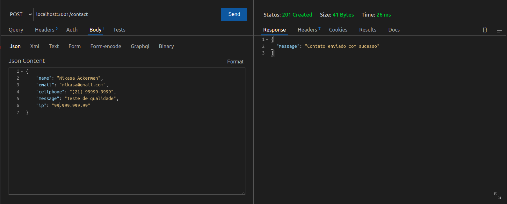

# Projeto Recebido pela MSB Tecnologia - Sistema Para Contato (Back-end)

### Sumário

1. [Sobre o Projeto](#sobre-o-projeto)
   - [Padrões de Projeto](#padrões-de-projeto)
   - [Tecnologias Utilizadas](#tecnologias-utilizadas)
2. [Como Rodar o Projeto Em Sua Máquina](#como-rodar-o-projeto-em-sua-máquina)
   - [Pré Requisitos](#pré-requisitos)
   - [Instalando Dependências](#instalando-dependências)
   - [Rodando o Projeto](#rodando-o-projeto)
3. [Como Rodar os Testes em sua Máquina](#como-rodar-os-testes-em-sua-máquina)
   - [Rodando os Testes](#rodando-os-testes)
4. [Endpoints do Projeto](#endpoints-do-projeto)
   - [POST /contact](#post-contact)
5. [Considerações Finais](#considerações-finais)

---

## Sobre o Projeto
Este é o _Back-end_ do projeto __MSB Tech - Sistema Para Contato__ que tem a finalidade de salvar num banco de dados os registros de contatos.

#### Padrões de Projeto
Busquei organizar as pastas e dividir as responsabilidades do código utilizando o modelo *MSC* (Model, Service e Controller) onde o `Model` é responsável pela interação direta com o banco de dados, o `Service` com as regras de negócio e o `Controller` sendo a camada de contato direto com o usuário. <br/>
Busquei também usar alguns dos princípios de *SOLID* colocando em prática as ideias de `Single Responsibility Principle`, `Open/Closed Principle` e `Dependency Inversion Principle`.

#### Tecnologias Utilizadas
Para este projeto eu utilizei as seguintes tecnologias:

- JavaScript (ES6)
- Node.JS
- Express
- MongoDB

Usei também as bibliotecas:

- nodemon
- joi

Para qualidade de código foi usado:

- eslint-config-trybe-backend
- mocha
- chai
- chai-http
- sinon
- mongodb-memory-server

---

## Como Rodar o Projeto Em Sua Máquina

#### Pré Requisitos
Primeiro, será necessário que você tenha instalado o Git, Node (NPM) e o MongoDB em sua máquina. Caso não tenha e precise de uma força, siga os tutoriais dos links abaixo.

<a href="https://git-scm.com/book/pt-br/v2/Come%C3%A7ando-Instalando-o-Git">Tutorial do Git</a> <br/>
<a href="https://balta.io/blog/node-npm-instalacao-configuracao-e-primeiros-passos">Tutorial do Node</a> <br/>
<a href="https://medium.com/danieldiasjava/obtendo-e-configurando-o-mongodb-em-seu-ambiente-10ff98d868fa">Tutorial do MongoDB (Windows)</a> <br/>
<a href="https://www.digitalocean.com/community/tutorials/how-to-install-mongodb-on-ubuntu-20-04-pt">Tutorial do MongoDB (Linux)</a> <br/>
<a href="https://www.oficinadanet.com.br/post/13367-instalando-mongodb-no-mac-os-x">Tutorial do MongoDB (MacOS)</a> <br/>

Você também precisará de um _client_ como o <a href="https://insomnia.rest/download">Insomnia</a> ou então o <a href="https://www.postman.com/">Postman</a> para fazer as requisições aos endpoints e poder testar a aplicação.<br/>
Se estiver com o código aberto pelo *VS Code* eu lhe sugiro que use a extensão <a href="https://www.thunderclient.com/">Thunder Client</a>.

#### Instalando Dependências
Através do seu terminal, entre na pasta raiz do projeto e rode o comando: <br/>
```
npm install
```
Assim serão instaladas todas as dependências necessárias para que se possa rodar o projeto.

#### Rodando o Projeto
Para rodar o projeto use o comando:
```
npm start
```
ou então:
```
npm run dev
```
Esta segunda opção rodará o projeto usando o `nodemon`.

---

## Como Rodar os Testes em sua Máquina
Para este projeto foram desenvolvidos _testes de integração_ usando as bibliotecas `mocha`, `chai` e `sinon`. Com o auxílio ainda do `chai-http` para simular as requisições aos endpoints e do `mongodb-memory-server` para "_mochar_" a conexão com o banco de dados.

#### Rodando os Testes
Para rodar todos os arquivos de testes execute o comando:
```
npm run test
```
>*__Obs__*: No meu pc, às vezes, é necessário rodar, pelo menos, duas vezes por conta do tempo de execução dos testes. Adicionei um _timeout_ de 6s na execução dos testes para diminuir a ocorrência deste erro.

O resultado do comando acima será o seguinte:


Caso queira rodar apenas 1 teste específico, você pode usar `.only` antes de um __describe__ ou __it__ em um arquivo de teste.


O resultado do trecho acima será:


---

## Endpoints do Projeto

>*__Obs__*: As requisições foram feitas através do __Thunder Client__

#### POST /contact
Este _endpoint_ é responsável por salvar um registro de contato enviado pelo usuário.

- _Headers_: este _endpoint_ não recebe _headers_;
- _Inputs_: este _endpoint_ recebe os seguintes dados:
```
"name":       String | Campo Obrigatório,
"email":      String | Campo Obrigatório,
"cellphone":  String | Campo Obrigatório,
"message":    String | Campo Obrigatório,
"ip":         String | Campo Obrigatório,
```
- _Outputs_: este _endpoint_ retorna um objeto contendo o a chave "__message__" com o valor: __Contato enviado com sucesso__;
- _Status_: retorna o status __201__.

Imagem ilustrativa:



##### Caso de Falha

Caso algum valor não seja passado ou tenha seu valor inválido, será retornado:

- Objeto com chave __message__ e o valor correspondente ao erro (padrão da lib _Joi_) como no exemplo abaixo;
- Status HTTP __400__.


---

## Considerações Finais
Aqui eu encerro esta documentação. Espero que tenha ficado o mais claro, o mais nítido possível e que não tenha passado nenhuma etapa despercebida por mim.

Muito obrigado por ter conferido este projeto!! <br/>
Abraços!
